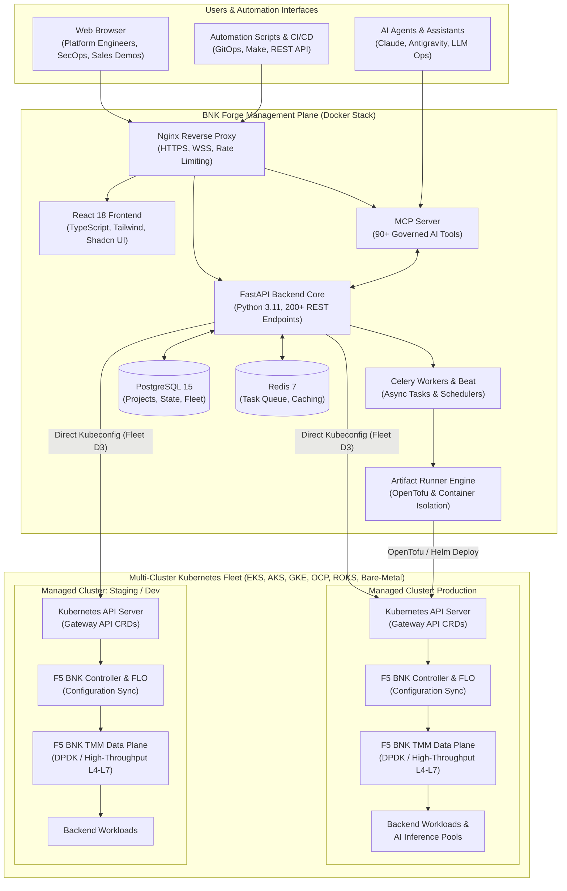
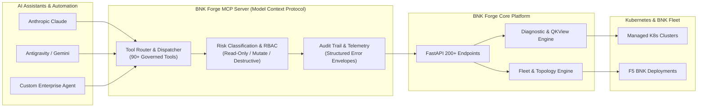

# F5 BIG-IP Next for Kubernetes — BNK Forge

**The Enterprise Management Plane for F5 BNK: Deploy, Operate, Monitor, and Evolve in Minutes, Not Days.**


---

## Executive Overview

**F5 BIG-IP Next for Kubernetes (BNK)** delivers high-performance L4–L7 ingress, carrier-grade resilience, DPDK/SR-IOV hardware acceleration, and advanced application security to cloud-native Kubernetes environments.

However, operating modern Gateway API architectures across multi-cloud and hybrid clusters can be daunting: managing 38+ Custom Resource Definitions (CRDs), manual YAML manifests, complex DPDK/TMM networking, and fragmented Day-2 troubleshooting.

**BNK Forge** solves these challenges by providing a single pane of glass that bridges the gap between raw Kubernetes primitives and enterprise operations. From 1-click Day-1 deployments to visual traffic topology, multi-cluster fleet governance, 1-click QKView diagnostics, and AI-operable MCP automation, BNK Forge enables teams to maximize the value of F5 BNK with confidence.

---

## Value by Role

### 🎯 For Customers & Platform Engineers
* **Accelerated Time-to-Value**: Deploy complete, production-grade BNK stacks in under 10 minutes with pre-packaged, validated blueprints.
* **Bridge NetOps & DevOps**: Provide platform teams with standard Kubernetes Gateway API routing while giving security and network engineers familiar F5 policies (Firewalls, DDoS, WAF, iRules).
* **Eliminate Guesswork & Drift**: Visualize live Gateway topologies, detect out-of-band changes automatically, and promote configurations safely across Dev, Staging, and Production clusters.
* **Direct & Non-Invasive**: Kubeconfig-first fleet architecture connects securely to existing clusters without requiring complex in-cluster daemons.
* **Enterprise Security**: Built-in RBAC (Admin, Operator, Viewer), JWT authentication, forced password rotation, and an immutable audit trail for all mutating operations.

### 💼 For F5 Field Sales & Solution Architects (SEs / SAs)
* **10-Minute Live PoCs**: Turn multi-hour manual setups into rapid, impressive demonstrations. Walk into a customer meeting and spin up a running BNK deployment live.
* **Visual Storytelling**: Replace 20 terminal windows and thousands of lines of YAML with an interactive topology graph showing real-time traffic flows, listener attachments, and policy enforcement.
* **AI & Modern Workload Showcase**: Demonstrate F5 BNK as the premier high-throughput AI Gateway for LLM inference (vLLM, Ollama, TensorRT-LLM) using built-in latency and concurrency benchmark suites.
* **Proven ROI & Risk Reduction**: Provide decision-makers with concrete evidence of reduced engineering overhead, accelerated migrations from legacy BIG-IP / CIS, and minimized operational risk.
* *See the [DevCentral Field & Solutions Guide](docs/DEVCENTRAL_OVERVIEW.md) for demo scripts, customer battlecards, and objection handling.*

### 🛠️ For Internal F5 Engineers, TAC, & Developers
* **Instant Lab & Bug Reproduction**: Recreate customer topologies in minutes across AWS EKS, Azure AKS, Google GKE, Red Hat OpenShift, IBM Cloud ROKS, or Bare Metal / DPF SmartNICs.
* **1-Click Diagnostic Capture**: Generate full BNK QKView diagnostic tarballs directly from CWC and inspect live TMM debug data (`tmctl` packet drops, `configview` compiled CRD state, `bdt_cli` routing/ARP tables).
* **Deep CRD & Hardware Lifecycle**: Full visibility and schema-validated management for all 38+ BNK resource kinds and DPF hardware configurations.
* **AI-Operated Fleet (MCP)**: 91 governed Model Context Protocol tools allow AI assistants (Claude, Antigravity, custom agents) to inspect, triage, and remediate cluster states programmatically.

---

## Before vs After: Realized Value Matrix

| Operation / Challenge | Without BNK Forge (Manual CLI & YAML) | With BNK Forge (Management Plane) | Tangible Impact / ROI |
|---|---|---|---|
| **Deploying BNK to a Cluster** | Hours of writing custom OpenTofu/Terraform scripts, Helm values, and 200+ lines of raw YAML | Select a Blueprint &rarr; Click Deploy &rarr; Live dependency pipeline visualization | **Hours &rarr; &lt; 10 minutes**<br>Eliminates configuration mistakes |
| **Understanding Traffic Flow** | Reading disparate Gateway, Route, and Policy manifests across multiple namespaces | Interactive **Gateway Topology** graph showing Gateways, Listeners, Policies, and Backends | **Guesswork &rarr; Instant Clarity**<br>Visual verification across all layers |
| **Day-2 Incident Triage & TAC** | Execing into TMM pods, chasing logs, manually running shell diagnostics | 1-click **QKView** generation, built-in TMM debug (`tmctl`, `bdt_cli`), automated runbooks | **Hours &rarr; Minutes**<br>80% faster support case turnaround |
| **Promoting Config Across Clusters** | Manual YAML exports, diffing with command-line tools, copy-pasting into production | Built-in configuration snapshotting, visual cluster diffing, and one-click promotion | **Days &rarr; Minutes**<br>Zero-drift staging to production promotion |
| **Fleet Health & Visibility** | Looping `kubectl` commands across separate cloud consoles, VPNs, and kubeconfigs | Unified **Command Center & Fleet Dashboard** tracking TMM/FLO status across all clouds | **30 min &rarr; 10 seconds**<br>Proactive multi-cloud health at a glance |
| **AI Inference Gateway Validation** | Ad-hoc curl scripts; unknown time-to-first-token (TTFT) or concurrency drop-off | Integrated **AI Performance Benchmarks** measuring latency, throughput, and error curves | **Verifiable SLAs**<br>Confidently size LLM gateway clusters |
| **AI-Assisted Operations** | High risk of unintended mutations; zero role governance or structured recovery | 91 governed **MCP Tools** with risk classifications, RBAC, and audit logs | **Safe Agentic Ops**<br>Natural-language infrastructure operations |

---

## Platform Architecture

### High-Level System & Fleet Architecture

BNK Forge runs as a lightweight, modular Docker Compose stack that connects directly to target Kubernetes clusters via kubeconfig:



---

### Operational Lifecycle: Day 1 to Day 2

```mermaid
flowchart LR
    subgraph Day1["Day 1: Deploy"]
        D1["Select Blueprint\n(EKS, AKS, GKE, OCP, Bare-Metal)"] --> D2["Automated Pre-flight\n& Variable Wiring"]
        D2 --> D3["Containerized Engine\n(OpenTofu / Direct K8s)"]
        D3 --> D4["Running BNK Cluster\n(< 10 Minutes)"]
    end

    subgraph Day2Operate["Day 2: Operate & Govern"]
        O1["Gateway Topology View\n(Gateways, Routes, Backends)"]
        O2["Visual Policy Builder\n(Firewall, DDoS, WAF, iRules)"]
        O3["Config Snapshot & Diff\n(Cross-Cluster Promotion)"]
    end

    subgraph Day2Monitor["Day 2: Monitor & Diagnose"]
        M1["Fleet Health Dashboard\n(Real-time TMM/FLO status)"]
        M2["Drift Detection\n(Out-of-band change alerts)"]
        M3["1-Click Diagnostics\n(QKView, TMM Debug, Runbooks)"]
        M4["AI Gateway Benchmarks\n(LLM Latency & Concurrency)"]
    end

    D4 --> O1
    O1 --> O2
    O2 --> O3
    O3 --> M1
    M1 --> M2
    M2 --> M3
    M3 --> M4
```



---

### F5 BNK Traffic Flow & Gateway API Topology

BNK Forge provides complete visibility into how external client traffic enters the cluster, reaches F5 BNK TMM data planes, traverses Gateway API listeners, applies security policies, and routes to backend microservices or AI models:

```mermaid
flowchart TD
    Client["Client Traffic\n(HTTPS, gRPC, TCP, UDP, AI Prompts)"] --> ExternalVIP["External Virtual IP (VIP)\n/ BGP Anycast"]
    
    subgraph BNKDP["F5 BIG-IP Next for Kubernetes (Data Plane)"]
        TMM["TMM High-Performance Engine\n(DPDK / SR-IOV / Hardware Acceleration)"]
        GW["Gateway Listener\n(Port 443 / TLS Termination)"]
        
        subgraph Policies["Security & Traffic Policies"]
            FW["Firewall Policies"]
            DDoS["DDoS Defense"]
            WAF["Security Policies (WAF)"]
            IRule["iRules & L4-L7 Filters"]
        end

        subgraph Routes["Routing Rules"]
            HR["HTTPRoute / GRPCRoute"]
            TR["TLSRoute / TCPRoute"]
            AI["F5BigAnalyzer (AI Inference Routing)"]
        end

        TMM --> GW
        GW --> Policies
        Policies --> Routes
    end

    ExternalVIP --> TMM

    subgraph K8sBackends["Kubernetes Workloads"]
        B1["Microservice Pods\n(Namespace: apps)"]
        B2["Payment Service\n(Namespace: secure)"]
        B3["vLLM / TensorRT-LLM\n(Inference Model Pods)"]
    end

    Routes -->|Route /api| B1
    Routes -->|Route /pay (Mutual TLS)| B2
    Routes -->|Route /v1/chat/completions| B3
```

---

### Governed AI Operations (MCP Server)

BNK Forge includes a dedicated Model Context Protocol (MCP) server that empowers AI assistants to interact with the platform under strict security and audit controls:



---

## Core Capabilities Walkthrough

### 🚀 Day 1 — Automated Deployment & Blueprints
* **Pre-Packaged Blueprints**: Turnkey stacks for AWS EKS, Azure AKS, Google GKE, Red Hat OpenShift, IBM Cloud ROKS, and On-Premises Bare-Metal / DPF BlueField-3.
* **Intelligent Dependency Management**: Automatically calculates execution order and wires outputs between modules (VPC &rarr; EKS &rarr; BNK &rarr; Gateway API).
* **Parallel Layer Execution**: Concurrently provisions independent modules, reducing deployment time by 25–50%.
* **Zero Host Pollution**: Execution engines run inside isolated, ephemeral container runners.

### 🗺️ Day 2 — Gateway Topology & Policy Builder
* **Interactive Topology Map**: Clickable graphical representation of Gateways, Listeners, Routes, Policies, and Services.
* **Visual Policy Builder**: Easily attach Firewall policies, DDoS profiles, WAF rules, and iRules to Gateway listeners without manual YAML authoring.
* **Service Cross-Referencing**: Instantly find which routes, listeners, and namespaces expose any Kubernetes backend service.

### 🌐 Day 2 — Multi-Cluster Fleet & Config Promotion
* **Unified Fleet Dashboard**: Live health tracking of FLO, TMM, and Gateways across all connected clusters.
* **Drift Detection**: Automated background polling detects out-of-band changes to infrastructure and manifests.
* **Configuration Snapshot & Promotion**: Capture known-good BNK resource states, view visual side-by-side cluster diffs, and promote changes across environments (Dev &rarr; Staging &rarr; Production) with a single click.

### 🩺 Day 2 — Integrated Diagnostics & TAC Tooling
* **1-Click QKView**: Fetch complete diagnostic archives directly from CWC for fast submission to F5 TAC and iHealth.
* **Live TMM Debug Terminal**: Run `tmctl` (traffic drops and stats), `configview` (effective in-memory configuration), and `bdt_cli` (ARP and routing tables) without shell access to worker nodes.
* **Automated Runbooks**: Step-by-step diagnostic workflows for common issues (certificate renewals, FLO sync stalls, pod evictions).
* **Safe Rolling Upgrades**: Upgrade BNK versions with automated pre-flight checks, health gates, and instant rollback.

### ⚡ AI Gateway & LLM Inference Benchmarks
* **LLM Benchmark Suite**: Stress-test AI gateways and model servers (vLLM, TensorRT-LLM, Triton).
* **Critical Metrics**: Measure Time-To-First-Token (TTFT), token throughput per second, concurrency scaling, and latency percentiles.
* **AI Analyzer Verification**: Benchmark the performance gains of F5 BNK AI load-balancing analyzers (`F5BigAnalyzer`) under live simulated traffic.

---

## Quick Start

**Prerequisites:** [Docker](https://docs.docker.com/get-docker/) with Docker Compose, and Git.

### 1. Laptop (macOS / Windows WSL2)

```bash
git clone https://github.com/f5devcentral/bnk-forge.git
cd bnk-forge
docker network create --driver bridge --subnet 10.200.0.0/24 bnk-forge-artifacts   # once per host
make local-deploy
```

Open **https://localhost** in your browser and accept the self-signed certificate warning.

### 2. Linux Server

```bash
git clone https://github.com/f5devcentral/bnk-forge.git
cd bnk-forge
docker network create --driver bridge --subnet 10.200.0.0/24 bnk-forge-artifacts   # once per host
make deploy
```

Access via **https://your-server-ip**.

---

### Initial Login & Password Rotation

| Field | Initial Value |
|---|---|
| **Username** | `admin` |
| **Password** | *Randomly generated on first startup* |

Retrieve your generated admin password from the backend container:

```bash
docker exec bnk-forge-backend cat /app/keys/initial_admin_password
```

*(You will be required to choose a new password upon first login.)*

---

### Prerequisite: the artifact runner network

BNK Forge's container-image engine runs each deployment artifact step in its own isolated container attached to a dedicated bridge network named **`bnk-forge-artifacts`**. Create it once per host:

```bash
docker network create --driver bridge --subnet 10.200.0.0/24 bnk-forge-artifacts
```

<details>
<summary><b>Why is this required? (Technical Deep Dive)</b></summary>

1. **Subnet Isolation:** Docker's auto-assigned IP pools can overlap with host VPNs or corporate subnets. Pinning a dedicated subnet prevents mid-deployment network collisions.
2. **Outside Compose:** On Linux servers, BNK Forge runs with `network_mode: host` for performance, which prevents Compose from declaring a bridge network in the same stack. The artifact network exists strictly for ephemeral runner containers.
3. **Subnet Customization:** You can define a custom CIDR via `ARTIFACT_NETWORK_SUBNET=<cidr>` or set `ARTIFACT_NETWORK_SUBNET=auto` in `.env`.
4. **Convenience:** Running `make deploy` or `make local-deploy` automatically invokes `make ensure-artifact-network` if it does not already exist.

</details>

---

## Common Commands

| Command | Description |
|---|---|
| `make local-deploy` | Build & start all containers on laptop (Docker Desktop / WSL2) |
| `make local-up` | Start existing laptop containers without rebuilding |
| `make local-down` | Stop laptop containers |
| `make local-logs` | Tail laptop container logs |
| `make deploy` | Build & start all containers on Linux server (host networking) |
| `make up` | Start existing server containers |
| `make down` | Stop server containers |
| `make server-logs` | Tail server container logs |
| `make status` | Check health and version of all running containers |
| `make upgrade-safe` | Preferred non-destructive server upgrade path with strict health pre-checks |
| `make mcp-readiness` | Verify MCP service liveness and runtime tool readiness |
| `make test` | Run entire test suite (backend, frontend, proxy, operator) |
| `make help` | Display full list of available targets |

---

## Configuration & First Steps

### 1. Configure the Module Library
To enable pre-packaged deployment blueprints after logging in:
1. Navigate to **Settings > Defaults**.
2. Set **Module Library Git URL** to: `https://github.com/JLCode-tech/bnk-forge-modules.git`
3. Set **Module Library Git Ref** to: `release/2.2`
4. Go to **Settings > Environment Config** and click **Sync Modules**.

### 2. Connect Your Kubernetes Clusters
BNK Forge connects to clusters using standard kubeconfigs:
1. Navigate to **Kubernetes > Clusters**.
2. Click **Add Cluster**.
3. Paste or upload your `kubeconfig` file.
4. Forge will automatically discover namespaces, nodes, workloads, and BNK custom resources.

---

## Project Structure

```
bnk-forge/
├── backend/              # FastAPI REST backend & task workers (Python 3.11)
│   ├── routes/           #   200+ API endpoints (RBAC-enforced)
│   ├── services/         #   Business logic (BNK, K8s, Topology, Diagnostics)
│   ├── models/           #   SQLAlchemy database models
│   └── modules/          #   Python-defined deployment modules
├── frontend-v2/          # React 18 SPA (TypeScript + Vite + Tailwind + shadcn/ui)
│   └── src/
│       ├── components/   #   UI components & visual topology viewers
│       ├── pages/        #   Route pages (Command Center, Topology, Benchmarks)
│       └── hooks/        #   React Query data hooks
├── mcp-server/           # Model Context Protocol server (90+ AI tools)
├── proxy/                # Nginx reverse proxy (SSL, WebSocket, rate limiting)
├── scripts/              # Build, validation, and maintenance automation
├── docs/                 # Documentation hub
├── docker-compose.yml    # Linux production stack (host networking)
├── docker-compose.local.yml # Laptop overlay (bridge networking with port publishing)
└── Makefile              # Platform-aware automation harness
```

---

## Curated Documentation Hub

| Guide | Description | Target Audience |
|---|---|---|
| [**DevCentral Field & Solutions Guide**](docs/DEVCENTRAL_OVERVIEW.md) | Comprehensive field battlecards, 10-min demo scripts, and TAC diagnostic workflows | Customers, SEs, Solutions Architects, TAC |
| [**User Guide**](docs/USER_GUIDE.md) | Complete walkthrough of all UI features, workflows, and configuration options | Platform Engineers, Operators, Administrators |
| [**API Reference**](docs/API_REFERENCE.md) | Full catalog of 200+ REST API endpoints with request/response schemas | DevOps, Automation Engineers, Developers |
| [**Installation Guide**](docs/INSTALLATION.md) | Detailed installation steps for laptop, bare-metal, VM, and cloud environments | Systems Administrators, DevOps |
| [**Production Deployment**](docs/DEPLOYMENT.md) | Best practices for hardening and sizing production deployments | Infrastructure Architects, SREs |
| [**Troubleshooting Runbook**](docs/TROUBLESHOOTING.md) | Common error signatures, resolution steps, and diagnostic procedures | Operators, Support Engineers |
| [**Server Upgrade Runbook**](docs/UPGRADE_RUNBOOK.md) | Step-by-step procedures for non-destructive platform upgrades | Platform Administrators |
| [**Testing Guide**](docs/TESTING.md) | Test architecture, test suites, and validation standards | Contributors, Developers |
| [**Docker Architecture**](docs/DOCKER.md) | Multi-target Dockerfile design, image verification, and supply chain | Security & DevOps Engineers |
| [**Disk Management**](docs/DISK_MANAGEMENT.md) | Managing Docker storage, image cache, and scheduled cleanup | System Administrators |
| [**AWS SSO Setup**](docs/AWS_SSO_SETUP.md) | Configuring enterprise AWS IAM Identity Center authentication | Security & Cloud Architects |
| [**BlueField-3 DPU Provisioning**](docs/DPU_PROVISIONING_GUIDE.md) | Bare-metal provisioning with NVIDIA BlueField-3 SmartNICs | Hardware & Network Engineers |
| [**Module & Blueprint Authoring**](docs/How%20to%20write%20CI%20container%20runner%20modules%20and%20blueprints%20for%20BNK%20Forge.md) | Creating custom reusable runner modules and blueprints | Automation Engineers, Contributors |
| [**Product Vision**](docs/PRODUCT_VISION.md) | Long-term architectural direction and platform strategy | Product Managers, Architects |
| [**Platform Roadmap**](docs/ROADMAP.md) / [HTML View](docs/roadmap.html) | Completed milestones, active priorities, and planned features | Community, Customers, Engineering |

---

## Version Compatibility

| BNK Forge Release | Module Library Ref | F5 BNK Version | Support Status |
|---|---|---|---|
| **Current branch** | **`release/2.2`** | **2.2 GA** | **Active (Recommended)** |
| 2.10.x – 2.12.x | `release/2.2` | 2.2 GA | Maintained |

---

## License & Governance

* **License**: Licensed under the [Apache License, Version 2.0](LICENSE).
* **Contributing**: Please review [CONTRIBUTING.md](CONTRIBUTING.md) and [docs/DEVELOPMENT.md](docs/DEVELOPMENT.md).
* **Code of Conduct**: See [CODE_OF_CONDUCT.md](CODE_OF_CONDUCT.md).
* **Security Policy**: See [SECURITY.md](SECURITY.md) for vulnerability disclosure procedures.
