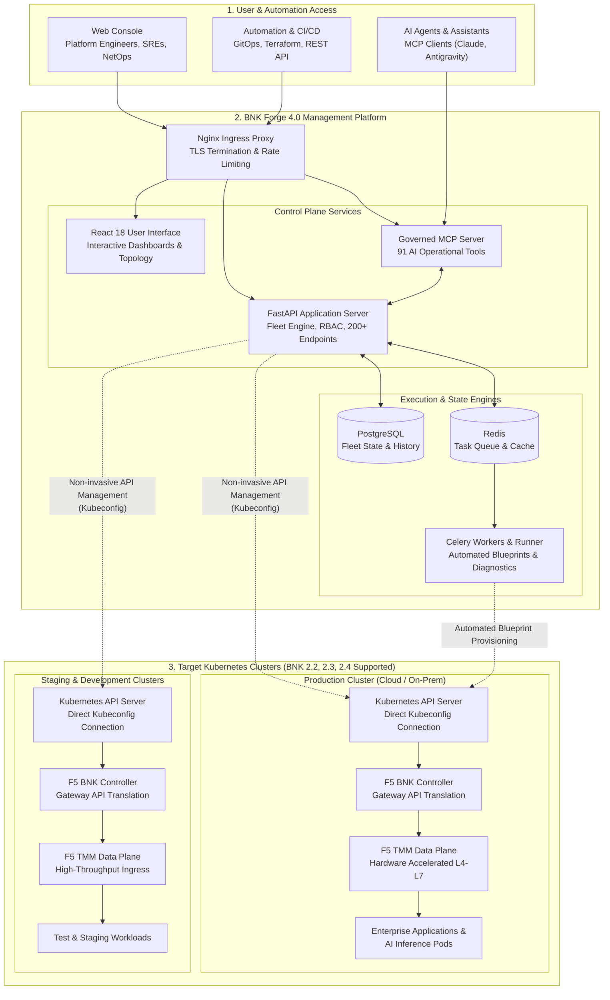
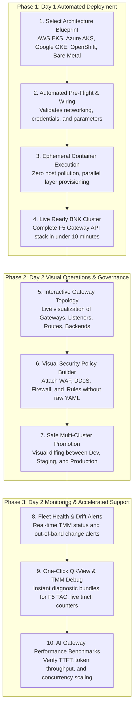
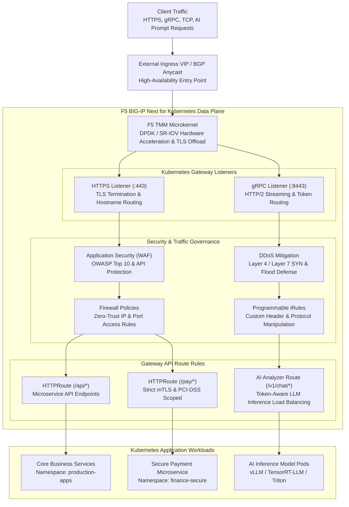

# F5 BIG-IP Next for Kubernetes — BNK Forge

**The Enterprise Management Plane for F5 BNK: Deploy, Operate, Monitor, and Evolve in Minutes, Not Days.**


---

## Executive Overview

**F5 BIG-IP Next for Kubernetes (BNK)** delivers high-performance L4–L7 ingress, carrier-grade resilience, DPDK/SR-IOV hardware acceleration, and advanced application security to cloud-native Kubernetes environments.

Operating modern Gateway API architectures across multi-cloud and hybrid clusters requires coordinating 38+ Custom Resource Definitions (CRDs), manual YAML manifests, DPDK/TMM networking, and multi-layered Day 2 troubleshooting.

**BNK Forge 4.0.0** is an orchestration and management plane purpose-built for **F5 BNK releases 2.2, 2.3, and 2.4**. It provides a single control point for automated multi-cloud deployments, interactive traffic topology visualization, multi-cluster fleet synchronization, one-click QKView diagnostics, and AI-operable MCP automation.

---

## Key Technical Capabilities

### Declarative Blueprint Deployment
* **Pre-Packaged Blueprints**: Turnkey infrastructure and BNK stacks for AWS EKS, Azure AKS, Google GKE, Red Hat OpenShift, IBM Cloud ROKS, and On-Premises Bare-Metal / DPF BlueField-3.
* **Automated Dependency Resolution**: Computes module execution order and wires outputs (VPC &rarr; EKS &rarr; BNK &rarr; Gateway API) with concurrent layer provisioning.
* **Isolated Container Runner**: Executes OpenTofu and Helm automation inside dedicated, ephemeral containers to guarantee zero host dependency pollution.

### Gateway API & Traffic Topology
* **Interactive Topology Graph**: Graphical visualization of Gateways, Listeners, Routes, Policies, and Backend services.
* **Visual Policy Management**: Inspect and configure Firewall policies, DDoS profiles, WAF rules, and iRules attached to Gateway listeners without writing manual YAML.
* **Backend Service Mapping**: Traces routes and listeners across namespaces to verify service exposure, health, and port allocations.

### Multi-Cluster Fleet Governance
* **Direct Kubeconfig Integration**: Manages clusters non-invasively through standard Kubernetes API server credentials without requiring in-cluster daemons.
* **Automated Drift Detection**: Regularly polls target clusters to identify out-of-band modifications to managed resources.
* **Configuration Snapshots & Promotion**: Captures resource states, generates semantic side-by-side cluster diffs, and promotes configurations across Dev, Staging, and Production.

### Day 2 Runtime Diagnostics
* **1-Click QKView Extraction**: Direct extraction of diagnostic bundles via Cloud Workspace Controller (CWC) for F5 iHealth and TAC analysis.
* **Live In-Memory TMM Debugging**: Direct console execution of `tmctl` (packet drops and stats), `configview` (effective in-memory configuration), and `bdt_cli` (ARP and routing tables).
* **Automated Runbooks**: Scripted diagnostic tests covering certificate validity, controller reconciliation, and network connectivity.

### AI Inference Gateway Benchmarks
* **LLM Benchmark Suite**: Stress-tests AI gateways and model servers (vLLM, TensorRT-LLM, Triton, Ollama).
* **Latency & Throughput Telemetry**: Measures Time-To-First-Token (TTFT), token throughput per second, concurrency scaling, and latency percentiles.
* **AI Analyzer Validation**: Verifies performance optimizations of F5 BNK AI load-balancing analyzers (`F5BigAnalyzer`).

### Governed Automation (REST API & MCP)
* **OpenAPI 3.0 REST API**: Over 200 endpoints covering all platform capabilities with role-based access control (Admin, Operator, Viewer).
* **Model Context Protocol (MCP)**: 91 AI-operable tools with tiered risk controls (Read-Only, Mutate, Destructive) and structured audit logging.

---

## Operational Comparison: Manual CLI vs BNK Forge

| Operational Area | Manual CLI & Manifests | BNK Forge Management Plane |
|---|---|---|
| **Cluster Provisioning** | Manual OpenTofu/Terraform scripts, Helm values, and custom YAML pipelines | Pre-packaged blueprints with automated variable wiring and dependency resolution |
| **Topology & Traffic Flow** | Inspecting disparate Gateway, Route, and Policy manifests across namespaces via CLI | Interactive visual graph mapping Gateways, Listeners, Policies, Routes, and Backends |
| **Diagnostics & Troubleshooting** | Manual `kubectl exec` into TMM pods, container log chasing, and manual tarball extraction | Direct CWC QKView export, live `tmctl`/`bdt_cli`/`configview` inspection, automated runbooks |
| **Cross-Cluster Promotion** | Manual YAML file export, text-based diffing, and manual `kubectl apply` | Snapshot engine with semantic cluster-to-cluster diffing and one-click promotion |
| **Fleet Monitoring** | Shell scripts looping `kubectl` across separate cloud consoles and kubeconfigs | Centralized Command Center monitoring TMM health, gateway status, and configuration drift |
| **AI Gateway Benchmarking** | Ad-hoc curl scripts without standardized metrics or concurrency analysis | Integrated benchmark suite tracking TTFT, token throughput, and latency percentiles |
| **Automated Tooling** | Uncontrolled shell scripts or ad-hoc API calls without unified audit logging | 200+ RBAC-controlled REST endpoints and 91 governed MCP tools with risk classifications |

---

## Platform Architecture

### High-Level System & Fleet Architecture

BNK Forge 4.0.0 runs as a lightweight, modular Docker Compose stack that connects directly to target Kubernetes clusters via standard kubeconfig credentials:



---

### Operational Lifecycle: Day 1 to Day 2



---

### F5 BNK Traffic Flow & Gateway API Topology

BNK Forge provides complete visibility into how client traffic enters the cluster, reaches F5 BNK TMM data planes, traverses Gateway API listeners, applies security policies, and routes to backend microservices or AI models:



---

### Governed AI Operations (MCP Server)

BNK Forge includes a dedicated Model Context Protocol (MCP) server that empowers AI assistants to interact with the platform under strict security and audit controls:

```mermaid
flowchart LR
    subgraph Agents["1. AI Assistants & Automation"]
        Claude["Anthropic Claude Desktop"]
        Gemini["Antigravity / Google AI"]
        CustomOps["Enterprise Autonomous Agents"]
    end

    subgraph SafetyGate["2. Governed MCP Server & Safety Gate"]
        Router["Tool Dispatcher\n91 Registered Tools"]
        
        subgraph RiskTiers["Enforced Risk Tiers"]
            TierRead["Read-Only Tier\nTopology, metrics, logs, health checks\nAuto-Approved"]
            TierMutate["Mutate Tier\nDeploy blueprint, update route, attach policy\nRequires Operator Role"]
            TierDestroy["Destructive Tier\nDelete cluster, purge config, rollback\nRequires Admin Confirmation"]
        end
        
        Audit["Immutable Audit Log\nOperator ID, timestamp, full payload"]
        Router --> RiskTiers
        RiskTiers --> Audit
    end

    subgraph ForgeEngine["3. BNK Forge Management Core"]
        RESTAPI["FastAPI 200+ REST Endpoints"]
        K8sEngine["Fleet & Topology Controller"]
        DiagEngine["Automated Diagnostic Engine"]
        
        RESTAPI --> K8sEngine
        RESTAPI --> DiagEngine
    end

    subgraph TargetFleet["4. Managed F5 BNK Fleet"]
        Clusters["Kubernetes Clusters\nAWS EKS, Azure AKS, GKE, OCP, Bare Metal"]
        BNKDeploy["F5 BNK Deployments\nSupported Releases: 2.2, 2.3, 2.4"]
        
        K8sEngine --> Clusters
        DiagEngine --> BNKDeploy
    end

    Claude --> Router
    Gemini --> Router
    CustomOps --> Router
    Audit --> RESTAPI
```



---

## Core Capabilities Walkthrough

### Day 1: Automated Deployment & Blueprints
* **Pre-Packaged Blueprints**: Turnkey stacks for AWS EKS, Azure AKS, Google GKE, Red Hat OpenShift, IBM Cloud ROKS, and On-Premises Bare-Metal / DPF BlueField-3.
* **Intelligent Dependency Management**: Automatically calculates execution order and wires outputs between modules (VPC &rarr; EKS &rarr; BNK &rarr; Gateway API).
* **Parallel Layer Execution**: Concurrently provisions independent modules, reducing deployment time by 25–50%.
* **Zero Host Pollution**: Execution engines run inside isolated, ephemeral container runners.

### Day 2: Gateway Topology & Policy Builder
* **Interactive Topology Map**: Clickable graphical representation of Gateways, Listeners, Routes, Policies, and Services.
* **Visual Policy Builder**: Easily attach Firewall policies, DDoS profiles, WAF rules, and iRules to Gateway listeners without manual YAML authoring.
* **Service Cross-Referencing**: Instantly find which routes, listeners, and namespaces expose any Kubernetes backend service.

### Day 2: Multi-Cluster Fleet & Config Promotion
* **Unified Fleet Dashboard**: Live health tracking of TMM, Gateways, and controllers across all connected clusters.
* **Drift Detection**: Automated background polling detects out-of-band changes to infrastructure and manifests.
* **Configuration Snapshot & Promotion**: Capture known-good BNK resource states, view visual side-by-side cluster diffs, and promote changes across environments (Dev &rarr; Staging &rarr; Production) with a single click.

### Day 2: Integrated Diagnostics & TAC Tooling
* **1-Click QKView**: Fetch complete diagnostic archives directly from CWC for fast submission to F5 TAC and iHealth.
* **Live TMM Debug Terminal**: Run `tmctl` (traffic drops and stats), `configview` (effective in-memory configuration), and `bdt_cli` (ARP and routing tables) without shell access to worker nodes.
* **Automated Runbooks**: Step-by-step diagnostic workflows for common issues (certificate renewals, sync stalls, pod evictions).
* **Safe Rolling Upgrades**: Upgrade BNK versions with automated pre-flight checks, health gates, and instant rollback.

### Day 2: AI Gateway & LLM Inference Benchmarks
* **LLM Benchmark Suite**: Stress-test AI gateways and model servers (vLLM, TensorRT-LLM, Triton).
* **Critical Metrics**: Measure Time-To-First-Token (TTFT), token throughput per second, concurrency scaling, and latency percentiles.
* **AI Analyzer Verification**: Benchmark the performance gains of F5 BNK AI load-balancing analyzers (`F5BigAnalyzer`) under live simulated traffic.

---

## Quick Start

**Prerequisites:** [Docker](https://docs.docker.com/get-docker/) with Docker Compose, and Git.

### 1. Laptop (macOS / Windows WSL2)

```bash
git clone https://github.com/f5devcentral/bnk-forge.git
cd bnk-forge
docker network create --driver bridge --subnet 10.200.0.0/24 bnk-forge-artifacts   # once per host
make local-deploy
```

Open **https://localhost** in your browser and accept the self-signed certificate warning.

### 2. Linux Server

```bash
git clone https://github.com/f5devcentral/bnk-forge.git
cd bnk-forge
docker network create --driver bridge --subnet 10.200.0.0/24 bnk-forge-artifacts   # once per host
make deploy
```

Access via **https://your-server-ip**.

---

### Initial Login & Password Rotation

| Field | Initial Value |
|---|---|
| **Username** | `admin` |
| **Password** | *Randomly generated on first startup* |

Retrieve your generated admin password from the backend container:

```bash
docker exec bnk-forge-backend cat /app/keys/initial_admin_password
```

*(You will be required to choose a new password upon first login.)*

---

### Prerequisite: the artifact runner network

BNK Forge's container-image engine runs each deployment artifact step in its own isolated container attached to a dedicated bridge network named **`bnk-forge-artifacts`**. Create it once per host:

```bash
docker network create --driver bridge --subnet 10.200.0.0/24 bnk-forge-artifacts
```

<details>
<summary><b>Why is this required? (Technical Details)</b></summary>

1. **Subnet Isolation:** Docker's auto-assigned IP pools can overlap with host VPNs or corporate subnets. Pinning a dedicated subnet prevents mid-deployment network collisions.
2. **Outside Compose:** On Linux servers, BNK Forge runs with `network_mode: host` for performance, which prevents Compose from declaring a bridge network in the same stack. The artifact network exists strictly for ephemeral runner containers.
3. **Subnet Customization:** You can define a custom CIDR via `ARTIFACT_NETWORK_SUBNET=<cidr>` or set `ARTIFACT_NETWORK_SUBNET=auto` in `.env`.
4. **Convenience:** Running `make deploy` or `make local-deploy` automatically invokes `make ensure-artifact-network` if it does not already exist.

</details>

---

## Common Commands

| Command | Description |
|---|---|
| `make local-deploy` | Build & start all containers on laptop (Docker Desktop / WSL2) |
| `make local-up` | Start existing laptop containers without rebuilding |
| `make local-down` | Stop laptop containers |
| `make local-logs` | Tail laptop container logs |
| `make deploy` | Build & start all containers on Linux server (host networking) |
| `make up` | Start existing server containers |
| `make down` | Stop server containers |
| `make server-logs` | Tail server container logs |
| `make status` | Check health and version of all running containers |
| `make upgrade-safe` | Preferred non-destructive server upgrade path with strict health pre-checks |
| `make mcp-readiness` | Verify MCP service liveness and runtime tool readiness |
| `make test` | Run entire test suite (backend, frontend, proxy, operator) |
| `make help` | Display full list of available targets |

---

## Configuration & First Steps

### 1. Configure the Module Library
To enable pre-packaged deployment blueprints after logging in:
1. Navigate to **Settings > Defaults**.
2. Set **Module Library Git URL** to: `https://github.com/JLCode-tech/bnk-forge-modules.git`
3. Set **Module Library Git Ref** to: `release/4.0` (or `release/2.2` for BNK 2.2 environments)
4. Go to **Settings > Environment Config** and click **Sync Modules**.

### 2. Connect Your Kubernetes Clusters
BNK Forge connects to clusters using standard kubeconfigs:
1. Navigate to **Kubernetes > Clusters**.
2. Click **Add Cluster**.
3. Paste or upload your `kubeconfig` file.
4. Forge will automatically discover namespaces, nodes, workloads, and BNK custom resources.

---

## Project Structure

```
bnk-forge/
├── backend/              # FastAPI REST backend & task workers (Python 3.11)
│   ├── routes/           #   200+ API endpoints (RBAC-enforced)
│   ├── services/         #   Business logic (BNK, K8s, Topology, Diagnostics)
│   ├── models/           #   SQLAlchemy database models
│   └── modules/          #   Python-defined deployment modules
├── frontend-v2/          # React 18 SPA (TypeScript + Vite + Tailwind + shadcn/ui)
│   └── src/
│       ├── components/   #   UI components & visual topology viewers
│       ├── pages/        #   Route pages (Command Center, Topology, Benchmarks)
│       └── hooks/        #   React Query data hooks
├── mcp-server/           # Model Context Protocol server (91 AI tools)
├── proxy/                # Nginx reverse proxy (SSL, WebSocket, rate limiting)
├── scripts/              # Build, validation, and maintenance automation
├── docs/                 # Documentation hub
├── docker-compose.yml    # Linux production stack (host networking)
├── docker-compose.local.yml # Laptop overlay (bridge networking with port publishing)
└── Makefile              # Platform-aware automation harness
```

---

## Curated Documentation Hub

| Guide | Description | Target Audience |
|---|---|---|
| [**DevCentral Technical Reference**](docs/DEVCENTRAL_OVERVIEW.md) | Technical architecture, Gateway API topology, diagnostic tooling, and operational reference | Platform Engineers, SREs, NetOps, TAC |
| [**User Guide**](docs/USER_GUIDE.md) | Complete walkthrough of all UI features, workflows, and configuration options | Platform Engineers, Operators, Administrators |
| [**API Reference**](docs/API_REFERENCE.md) | Full catalog of 200+ REST API endpoints with request/response schemas | DevOps, Automation Engineers, Developers |
| [**Installation Guide**](docs/INSTALLATION.md) | Detailed installation steps for laptop, bare-metal, VM, and cloud environments | Systems Administrators, DevOps |
| [**Production Deployment**](docs/DEPLOYMENT.md) | Best practices for hardening and sizing production deployments | Infrastructure Architects, SREs |
| [**Troubleshooting Runbook**](docs/TROUBLESHOOTING.md) | Common error signatures, resolution steps, and diagnostic procedures | Operators, Support Engineers |
| [**Server Upgrade Runbook**](docs/UPGRADE_RUNBOOK.md) | Step-by-step procedures for non-destructive platform upgrades | Platform Administrators |
| [**Testing Guide**](docs/TESTING.md) | Test architecture, test suites, and validation standards | Contributors, Developers |
| [**Docker Architecture**](docs/DOCKER.md) | Multi-target Dockerfile design, image verification, and supply chain | Security & DevOps Engineers |
| [**Disk Management**](docs/DISK_MANAGEMENT.md) | Managing Docker storage, image cache, and scheduled cleanup | System Administrators |
| [**AWS SSO Setup**](docs/AWS_SSO_SETUP.md) | Configuring enterprise AWS IAM Identity Center authentication | Security & Cloud Architects |
| [**BlueField-3 DPU Provisioning**](docs/DPU_PROVISIONING_GUIDE.md) | Bare-metal provisioning with NVIDIA BlueField-3 SmartNICs | Hardware & Network Engineers |
| [**Module & Blueprint Authoring**](docs/How%20to%20write%20CI%20container%20runner%20modules%20and%20blueprints%20for%20BNK%20Forge.md) | Creating custom reusable runner modules and blueprints | Automation Engineers, Contributors |
| [**Product Vision**](docs/PRODUCT_VISION.md) | Long-term architectural direction and platform strategy | Product Managers, Architects |
| [**Platform Roadmap**](docs/ROADMAP.md) / [HTML View](docs/roadmap.html) | Completed milestones, active priorities, and planned features | Community, Customers, Engineering |

---

## Version Compatibility Matrix

| BNK Forge Release | Supported F5 BNK Releases | Module Library Ref | Gateway API Version | Kubernetes Versions | Support Status |
|---|---|---|---|---|---|
| **4.0.0** | **2.2, 2.3, 2.4** | `release/4.0` | v1.1+ (Standard Channel) | 1.28 – 1.32 | **Active (Current Release)** |
| 3.x | 2.2, 2.3 | `release/2.2` | v1.0+ | 1.26 – 1.30 | Maintained |
| 2.x | 2.2 | `release/2.2` | v1.0 | 1.24 – 1.28 | Legacy |

---

## License & Governance

* **License**: Licensed under the [Apache License, Version 2.0](LICENSE).
* **Contributing**: Please review [CONTRIBUTING.md](CONTRIBUTING.md) and [docs/DEVELOPMENT.md](docs/DEVELOPMENT.md).
* **Code of Conduct**: See [CODE_OF_CONDUCT.md](CODE_OF_CONDUCT.md).
* **Security Policy**: See [SECURITY.md](SECURITY.md) for vulnerability disclosure procedures.
