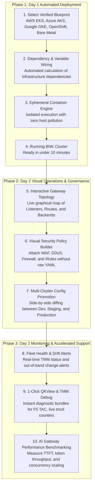
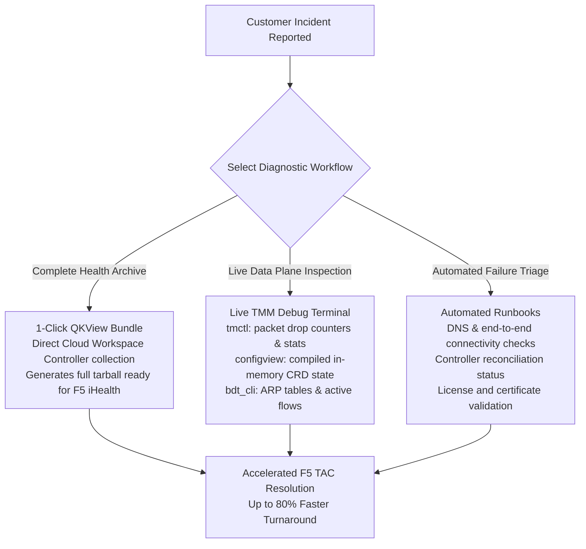
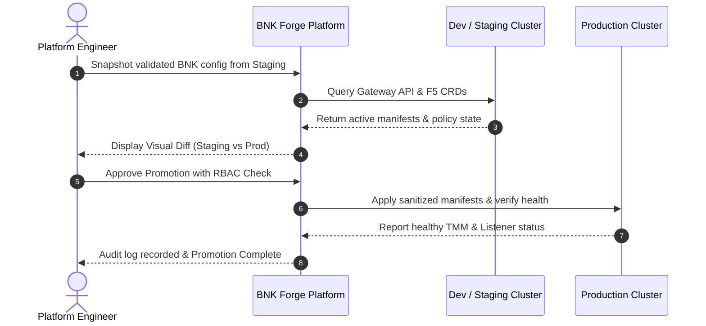
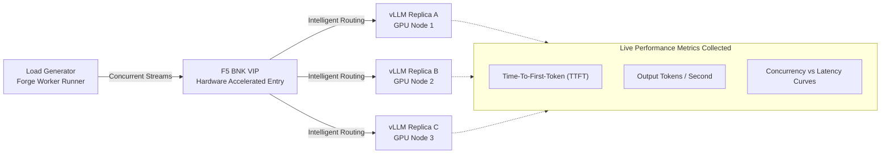
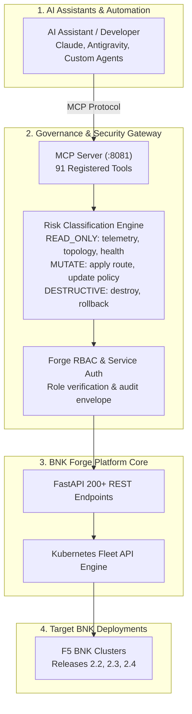

# F5 DevCentral Guide: Modernizing Kubernetes Ingress & Traffic Management with BNK Forge

> **A comprehensive technical guide for Customers, F5 Solution Architects, Field Sales, and TAC/Internal Engineers.**
> Explore how BNK Forge 4.0.0 transforms F5 BIG-IP Next for Kubernetes (BNK) across releases 2.2, 2.3, and 2.4 from complex YAML scripting into an intuitive, visual, and AI-operable management plane.

---

## Executive Summary

As enterprises modernize their application delivery infrastructure, **F5 BIG-IP Next for Kubernetes (BNK)** brings carrier-grade L4–L7 traffic management, hardware acceleration (SR-IOV, DPDK, SmartNIC/DPF), and comprehensive application security into cloud-native Kubernetes environments.

However, operating high-performance data planes across hybrid and multi-cloud Kubernetes clusters introduces operational hurdles:
- **Steep learning curve**: Managing 38+ custom resource definitions (CRDs), Gateway API specifications, and intricate YAML manifests.
- **Fragmented visibility**: No unified way to visualize how Gateway listeners, security policies, HTTP routes, and backend pods connect.
- **Difficult troubleshooting**: Digging through container logs, executing into TMM pods, and manually extracting diagnostic bundles during incidents.
- **Cross-cluster drift**: Promoting proven configurations safely from dev and staging clusters to production environments without human error.

**BNK Forge 4.0.0** solves these challenges. Supporting **F5 BNK releases 2.2, 2.3, and 2.4**, BNK Forge provides a unified management plane for **Day 1 automated deployment**, **Day 2 visual operations**, **integrated diagnostics (QKView / TMM debug)**, and **AI-operable infrastructure via the Model Context Protocol (MCP)**.

---

## Version Compatibility Matrix

| BNK Forge Release | Supported F5 BNK Releases | Module Library Ref | Gateway API Version | Kubernetes Versions | Support Status |
|---|---|---|---|---|---|
| **4.0.0** | **2.2, 2.3, 2.4** | `release/4.0` | v1.1+ (Standard Channel) | 1.28 – 1.32 | **Active (Current Release)** |
| 3.x | 2.2, 2.3 | `release/2.2` | v1.0+ | 1.26 – 1.30 | Maintained |
| 2.x | 2.2 | `release/2.2` | v1.0 | 1.24 – 1.28 | Legacy |

---

## 1. Field Playbook: Solution Architects & Sales Engineers (SEs)

BNK Forge is an essential asset for customer conversations, technical demonstrations, and Proof-of-Concept (PoC) engagements.

### The 3-Minute Elevator Pitch
> *"F5 BIG-IP Next for Kubernetes delivers the world’s fastest, most resilient Kubernetes data plane. BNK Forge is the management platform that lets your platform team deploy, visualize, and operate it Day 2 in minutes rather than weeks. Supporting BNK releases 2.2, 2.3, and 2.4, BNK Forge replaces hundreds of lines of complex Gateway API YAML with interactive topology maps, one-click diagnostic bundles, automated configuration promotion across clusters, and built-in AI inference performance testing."*

### 10-Minute Live Demo Walkthrough

When presenting to customers or running an executive workshop, follow this structured demo script:

| Minute | Stage | What to Show | Key Talking Point |
|---|---|---|---|
| **00:00 - 02:00** | **Command Center & Fleet** | Navigate to `/`. Show the multi-cluster Fleet Health ring, active deployments, and drift alerts. | *"Notice how we can monitor clusters running on AWS EKS, Azure AKS, Red Hat OpenShift, and on-prem bare metal from a single screen."* |
| **02:00 - 04:00** | **1-Click Deployment** | Open **Blueprints** (`/stacks`). Select an infrastructure blueprint (e.g. AWS EKS + BNK). Show the visual dependency pipeline. | *"Deploying BNK normally requires chaining multiple Terraform modules and manual Helm values. Forge automates variable wiring and executes layers concurrently."* |
| **04:00 - 07:00** | **Gateway Topology & Policies** | Open **F5 BNK > Gateway Topology** (`/bnk`). Click on a Gateway, expand its Listeners, view attached HTTPRoutes, security policies (WAF/Firewall/DDoS), and healthy backend endpoints. | *"This replaces running 15 kubectl commands across 4 namespaces. Application and security teams immediately see who owns which route and which policies are enforcing traffic."* |
| **07:00 - 08:30** | **Day 2 Diagnostics (QKView & TMM)** | Open **F5 BNK > Diagnostics**. Show 1-click **QKView** generation and the **TMM Debug** terminal (`tmctl`, `bdt_cli`). | *"When troubleshooting an issue, operators don't need root access or pod exec permissions. They can generate an F5 TAC-ready QKView or inspect real-time TMM drop counters in one click."* |
| **08:30 - 10:00** | **AI / LLM Benchmarking & MCP** | Open **Benchmarks** (`/benchmarks`). Show inference throughput, latency, and TTFT (Time-To-First-Token) curves. Mention the 91 MCP tools. | *"BNK is the premier AI Gateway for LLM inference (vLLM, Ollama). Forge has built-in benchmarking to prove throughput and latency under load, plus native AI agent automation."* |

### Handling Common Customer Questions

#### Q: "Does BNK Forge require an invasive agent or operator installed in all our production clusters?"
> **Answer**: No. BNK Forge employs a **kubeconfig-first fleet architecture**. It connects directly to the standard Kubernetes API server of your target clusters using your existing RBAC credentials. An optional cluster operator is available if needed for air-gapped or restricted networks, but is not required.

#### Q: "How does BNK Forge secure access and changes to our infrastructure?"
> **Answer**: BNK Forge implements strict Role-Based Access Control (**Admin**, **Operator**, **Viewer**), JWT token authentication with mandatory first-login password rotation, and an immutable audit log tracking every mutating API operation.

#### Q: "Can we integrate BNK Forge with our existing CI/CD or GitOps pipeline?"
> **Answer**: Yes. All functionality is exposed via 200+ OpenAPI-compliant REST endpoints. Furthermore, BNK Forge provides 91 Model Context Protocol (MCP) tools that enable modern AI workflows and automated scripts to inspect, test, and reconcile deployments safely.

---

## 2. Engineering & TAC Playbook: Support & Core Developers

For F5 TAC engineers, core developers, and professional services, BNK Forge dramatically reduces the time required to reproduce customer bugs and collect diagnostic artifacts across BNK 2.2, 2.3, and 2.4.

### Rapid Lab & Bug Reproduction
Instead of spending half a day writing OpenTofu manifests and assembling Helm values to mirror a customer's topology:
1. Use pre-built blueprints in BNK Forge to spin up a clean cluster on EKS, AKS, GKE, OpenShift, or bare metal.
2. Import the customer's sanitized configuration via **Config Export/Import** (`/bnk`).
3. Validate traffic flows using the integrated **Traffic Flow Overview**.

### 1-Click Diagnostic Toolkit
During escalations and customer support cases, use the **Diagnostics** module (`/bnk > Diagnostics`):

- **QKView Collection**: Collects the full BNK diagnostic tarball directly from the Cloud Workspace Controller (CWC). Download it directly through the browser or forward it to F5 iHealth.
- **TMM Debug Console**:
  - `tmctl`: Real-time query of internal TMM tables, packet processing statistics, and hardware drop counters.
  - `configview`: View the active compiled configuration in memory to verify whether a Kubernetes Gateway CRD was correctly translated into TMM runtime objects.
  - `bdt_cli`: Inspect low-level data plane networking: ARP caches, routing tables, and active TCP/UDP flows.
- **Automated Runbooks**: Execute pre-flight and diagnostic test sequences for common failure modes (DNS resolution, CWC certificate expiration, controller reconciliation stalls, node evictions).
- **Post-Reboot Recovery**: One-click recovery workflows to re-sync CWC certificates and cleanly restart platform controllers.

---

## 3. Customer & Platform Engineer Playbook

For enterprise platform engineering, DevOps, and SecOps teams, BNK Forge provides the operational controls needed to run F5 BNK at scale.

### Eliminating Configuration Drift & Promoting Changes

Managing Kubernetes configurations across multiple stages (Development → Staging → Production) often leads to configuration drift. BNK Forge includes a dedicated **Configuration Snapshot, Diff, and Promotion** engine:

1. **Snapshot**: Capture the exact state of all BNK resources (Gateways, HTTPRoutes, FirewallPolicies, HSL log profiles).
2. **Visual Diff**: Compare the snapshot against any other connected cluster. Forge highlights modified, missing, and extra resources.
3. **Selective Promotion**: Promote individual routes or full policy bundles with a single click.
4. **Auditability**: Every change is logged with the user ID, timestamp, and diff payload.

### Comprehensive CRD & Resource Lifecycle Management
BNK Forge provides complete visibility and lifecycle controls for all **38+ BNK custom resource types**:

- **Traffic Management**: `GatewayClass`, `Gateway`, `HTTPRoute`, `GRPCRoute`, `TCPRoute`, `UDPRoute`, `TLSRoute`, and backend service mapping.
- **Application Security**: `FirewallPolicy`, `FirewallRuleList`, `SecurityPolicy` (WAF), `NetworkPolicy`, `DDoSProtection`, address lists, and port lists.
- **Networking & Fabric**: `VLAN`, `StaticRoute`, `SNATPool`, `EgressConfig`, and `iRules`.
- **Hardware & DPF**: Integration with Data Plane Function (DPF) SmartNIC resources (18 CRDs).
- **Logging & Telemetry**: High-Speed Logging (`HSLPublisher`) and `LogProfile` definitions.

---

## 4. AI & Modern Workloads: The LLM Inference Gateway

Modern enterprise clusters increasingly host Generative AI and LLM inference workloads (e.g. vLLM, Ollama, TensorRT-LLM, Triton). F5 BNK is uniquely capable of handling high-bandwidth, long-lived streaming connections (Server-Sent Events) and token-based load balancing.

BNK Forge includes a native **Performance Benchmark Suite** (`/benchmarks`):

- **Load Testing Profiles**: Run standardized benchmark scenarios across model servers and proxies.
- **Real-Time Curves**: View latency-throughput trade-off curves, time-to-first-token (TTFT), inter-token latency, and error rates.
- **Scenario Comparison**: Compare performance before and after applying F5 BNK caching, SSL offload, or AI analyzer policies (`F5BigAnalyzer`).

---

## 5. Autonomous Operations: Governed MCP AI Server

BNK Forge includes a dedicated **Model Context Protocol (MCP)** server with **91 AI-operable tools**. This allows AI agents (Anthropic Claude Desktop, Google Antigravity, custom internal LLMs) to safely interact with your F5 BNK infrastructure:

### Safety & Governance Built In
- **Risk Tiers**: Every tool is classified (`read`, `mutate`, `destructive`). Read actions execute transparently; mutating actions require explicit confirmation and privilege elevation.
- **Structured Error Envelopes**: Errors return structured diagnostic hints so AI agents can self-correct parameters without human intervention.
- **Full Audit Logging**: Every prompt-driven action is recorded in the platform audit log.

---

## 6. Comparison: Traditional Manual Ops vs BNK Forge

| Workflow / Task | Traditional Manual CLI Approach | With BNK Forge | Tangible Benefit |
|---|---|---|---|
| **Deploy BNK Stack** | Hours of writing custom OpenTofu/Terraform scripts, Helm values, and 200+ lines of raw YAML | Pre-packaged blueprints deployed with 1-click; live visualization of module dependency graph | **Deploys in under 10 minutes**; eliminates syntax errors and misconfigurations |
| **Traffic & Topology Visibility** | Inspecting disparate `Gateway`, `HTTPRoute`, and F5 CRD YAML across namespaces via CLI | Real-time interactive Gateway Topology displaying listeners, routing rules, security policies, and backends | **Instant visual clarity** for AppDev, NetOps, and SecOps teams |
| **Day-2 Diagnostics & Troubleshooting** | Manual `kubectl exec` into TMM pods, hunting for logs, deciphering hex codes, piecing together TAC info | 1-click QKView export, built-in TMM debug commands (`tmctl`, `bdt_cli`, `configview`), automated runbooks | **Hours reduced to minutes**; cuts TAC ticket resolution cycle time by 80% |
| **Multi-Cluster Configuration Promotion** | Manual export, tedious YAML diffing, manual copy-paste across dev, staging, and production clusters | Built-in configuration snapshotting, visual cluster-to-cluster diffing, and one-click promotion | **Eliminates configuration drift** and prevents human error in production |
| **Fleet Health & Observability** | Looping `kubectl get pods` across separate kubeconfigs, clusters, and clouds | Single pane of glass fleet dashboard showing real-time health of TMM, gateways, and drift status | **Proactive monitoring** across all hybrid & multi-cloud deployments |
| **AI / LLM Gateway Operations** | Unmeasured latency, unknown TTFT (Time-To-First-Token), manual load generation scripts | Native LLM inference gateway benchmarking, latency curves, throughput analysis, and AI analyzer integration | **Verifiable performance SLAs** for generative AI enterprise applications |
| **AI-Assisted Operations** | Impossible or dangerous without governance, auditability, and guardrails | Governed Model Context Protocol (MCP) server with 91 tools, role-based safety gates, and audit trails | **Conversational infrastructure ops** ready for modern agentic workflows |

---

## 7. Getting Started & Additional Resources

- **GitHub Repository**: [f5devcentral/bnk-forge](https://github.com/f5devcentral/bnk-forge)
- **User Guide**: [docs/USER_GUIDE.md](USER_GUIDE.md)
- **API Reference**: [docs/API_REFERENCE.md](API_REFERENCE.md)
- **Installation Guide**: [docs/INSTALLATION.md](INSTALLATION.md)
- **Troubleshooting**: [docs/TROUBLESHOOTING.md](TROUBLESHOOTING.md)
- **F5 DevCentral Community**: [community.f5.com](https://community.f5.com)
