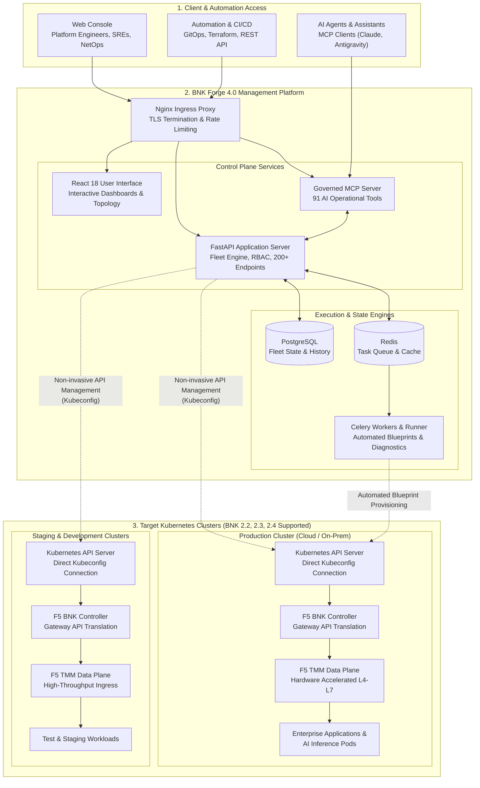
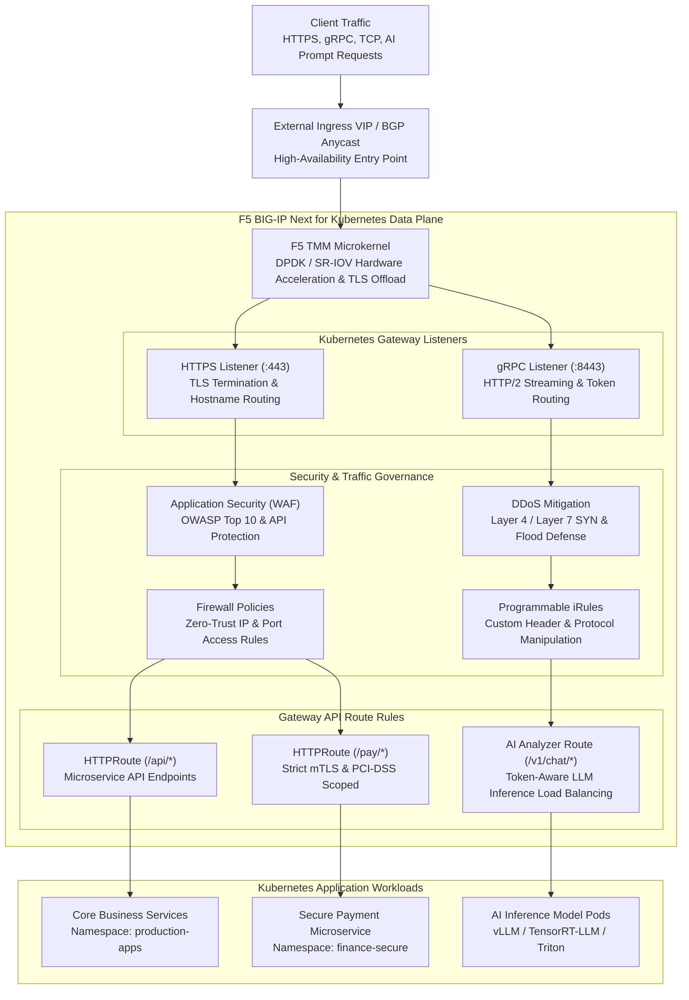
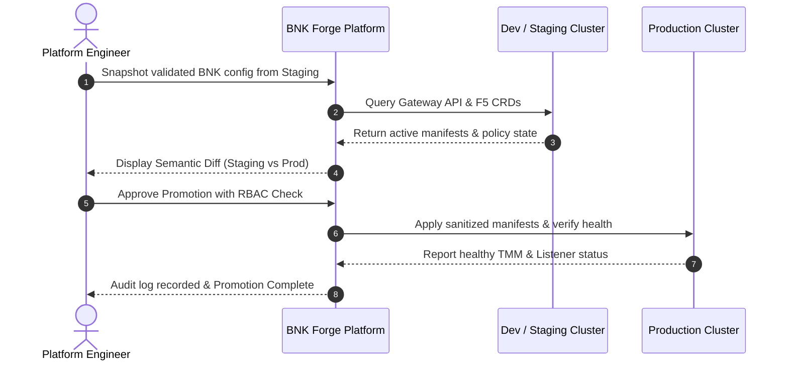
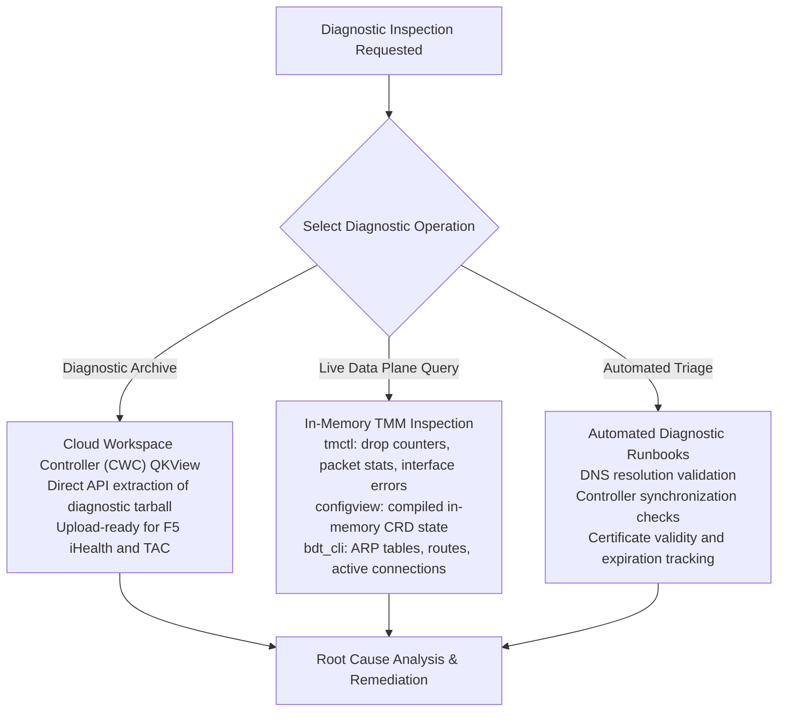
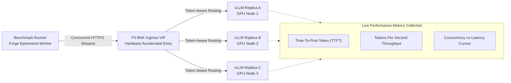
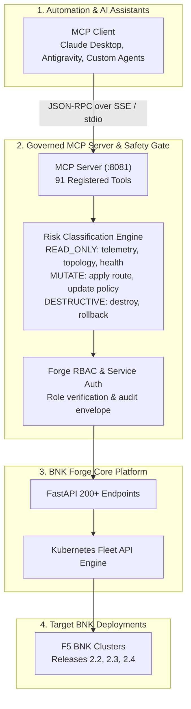

# F5 BIG-IP Next for Kubernetes (BNK) Management with BNK Forge

## Technical Architecture & Operations Reference

> Technical reference documentation for platform engineers, network architects, SREs, and F5 support engineers operating F5 BIG-IP Next for Kubernetes (BNK) with BNK Forge 4.0.0.

---

## 1. Architecture Overview

**F5 BIG-IP Next for Kubernetes (BNK)** provides high-performance L4–L7 ingress, SR-IOV and DPDK hardware acceleration, and application security policies in cloud-native Kubernetes environments.

**BNK Forge 4.0.0** is an orchestration and management plane built for F5 BNK deployments across **releases 2.2, 2.3, and 2.4**. It manages the full lifecycle of BNK infrastructure:
- Automated multi-cloud blueprint deployment across AWS EKS, Azure AKS, Google GKE, Red Hat OpenShift, IBM Cloud ROKS, and bare-metal environments.
- Declarative Kubernetes Gateway API and F5 CRD topology visualization and editing.
- Multi-cluster fleet synchronization, drift detection, and configuration promotion.
- Integrated Day 2 diagnostics: CWC QKView export, live TMM debugging via `tmctl`, `configview`, and `bdt_cli`.
- Performance benchmarking for standard ingress and LLM inference gateway workloads.
- Programmatic fleet operations via 200+ REST endpoints and 91 Model Context Protocol (MCP) tools.



---

## 2. Version Compatibility Matrix

| BNK Forge Release | Supported F5 BNK Releases | Module Library Ref | Gateway API Version | Kubernetes Versions | Support Status |
|---|---|---|---|---|---|
| **4.0.0** | **2.2, 2.3, 2.4** | `release/4.0` | v1.1+ (Standard Channel) | 1.28 – 1.32 | **Active (Current Release)** |
| 3.x | 2.2, 2.3 | `release/2.2` | v1.0+ | 1.26 – 1.30 | Maintained |
| 2.x | 2.2 | `release/2.2` | v1.0 | 1.24 – 1.28 | Legacy |

---

## 3. Kubernetes Gateway API & F5 BNK Data Plane Architecture

BNK Forge translates declarative Kubernetes Gateway API resources into active F5 BNK runtime objects. 

### Supported Resource Types
- **Standard Gateway API**: `GatewayClass`, `Gateway`, `HTTPRoute`, `GRPCRoute`, `TCPRoute`, `UDPRoute`, `TLSRoute`.
- **F5 BNK Security Policies**: `FirewallPolicy`, `FirewallRuleList`, `SecurityPolicy` (WAF), `DDoSProtection`, `NetworkPolicy`.
- **F5 BNK Networking Extensions**: `VLAN`, `StaticRoute`, `SNATPool`, `EgressConfig`, `iRules`, `F5BigAnalyzer`.
- **High-Speed Telemetry**: `HSLPublisher`, `LogProfile`.
- **Hardware Acceleration**: Data Plane Function (DPF) / SmartNIC configuration CRDs.

### Ingress Packet Flow & Policy Execution Pipeline



---

## 4. Multi-Cluster Fleet Governance & Configuration Promotion

Managing configurations across development, staging, and production clusters requires strict change tracking and drift detection.



### Technical Workflow
1. **Direct Kubeconfig Integration**: Connects to the standard Kubernetes API server of target clusters using RBAC credentials. No cluster agent is required.
2. **Configuration Snapshots**: Captures point-in-time declarative manifests of BNK and Gateway API resources in JSON/YAML format.
3. **Semantic Diffing**: Computes deep diffs between clusters, identifying modified, missing, and extra resources while filtering cluster-specific metadata (e.g. `uid`, `resourceVersion`, timestamps).
4. **Selective Promotion**: Promotes individual routes, security policies, or full stacks with single-click execution.
5. **Drift Detection**: Background Celery workers regularly poll target clusters to detect and alert on out-of-band modifications.

---

## 5. Day 2 Diagnostics & Runtime Inspection

BNK Forge provides native diagnostic tools for operators and TAC support engineers to analyze TMM runtime state and export diagnostic bundles.



### Diagnostic Utilities
- **1-Click QKView Extraction**: Gathers the complete BNK diagnostic tarball directly from the Cloud Workspace Controller (CWC) API. Archives can be downloaded locally or forwarded to F5 iHealth.
- **`tmctl` Querying**: Inspects live TMM statistical tables, hardware counters, and drop statistics directly through the web console without requiring SSH access to host nodes.
- **`configview` Inspection**: Reads the compiled in-memory runtime configuration to verify that Kubernetes Gateway CRDs were successfully compiled and loaded by the TMM microkernel.
- **`bdt_cli` Routing & ARP**: Inspects low-level data plane tables, including active ARP entries, static routes, and active Layer 4 connection state.
- **Automated Runbooks**: Scripted diagnostic tests that verify DNS connectivity, CWC certificate validity, controller reconciliation loops, and worker node health.

---

## 6. AI & LLM Inference Gateway Benchmarking

BNK Forge includes a dedicated benchmark engine to evaluate ingress throughput, latency, and connection handling under heavy load.



### Measured Parameters
- **Time-To-First-Token (TTFT)**: Measures prompt-processing latency percentiles (p50, p95, p99) under varying levels of concurrency.
- **Streaming Throughput**: Evaluates token generation rates (output tokens/sec) and connection reuse efficiency.
- **Concurrency Scaling**: Maps performance degradation curves as concurrent client sessions increase.
- **Policy Verification**: Compares benchmark performance before and after applying F5 BNK security policies and `F5BigAnalyzer` load-balancing rules.

---

## 7. Model Context Protocol (MCP) Architecture

BNK Forge provides a dedicated **Model Context Protocol (MCP)** server on port 8081, exposing **91 tools** for programmatic inspection and operations via AI assistants (Anthropic Claude, Google Antigravity) or custom automation engines.



### Risk Classification Model
- **`READ_ONLY`**: Telemetry collection, topology queries, health checks, log inspection. Executed without confirmation.
- **`MUTATE`**: Route application, policy attachment, blueprint deployment. Requires Operator-level credentials.
- **`DESTRUCTIVE`**: Cluster removal, resource deletion, rollback execution. Requires explicit Administrator confirmation.
- **Audit Logging**: All MCP requests and tool invocations are logged with the initiating identity, timestamp, and full execution payload.

---

## 8. Operational Reference & Verification

### Common Platform Management Commands

| Command | Action |
|---|---|
| `make local-deploy` | Build and start all platform containers on macOS / WSL2 |
| `make deploy` | Build and start production stack on Linux host |
| `make status` | Check runtime status and health of all platform containers |
| `make upgrade-safe` | Execute non-destructive platform upgrade with health pre-checks |
| `make mcp-readiness` | Verify MCP service status and tool availability |
| `make test` | Run platform test suite (backend, frontend, proxy, operator) |

### API Documentation
Interactive OpenAPI documentation (Swagger UI) is available at:
```
https://<forge-host>/docs
```
Raw OpenAPI JSON specification is accessible at:
```
https://<forge-host>/openapi.json
```
